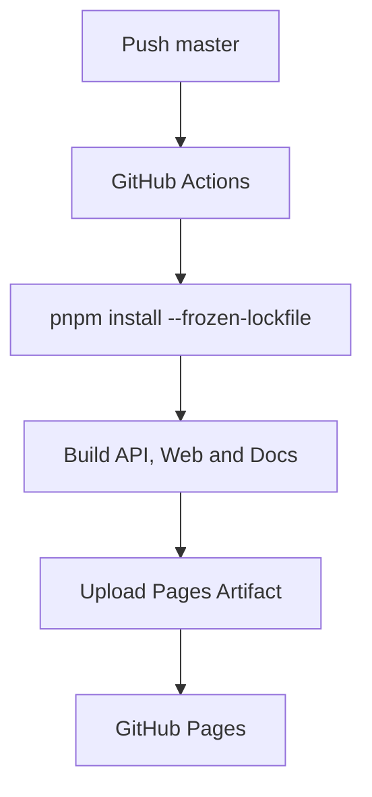

# 部署流程

```mermaid
flowchart TD
  Commit[Push master] --> CI[GitHub Actions]
  CI --> Install[pnpm install --frozen-lockfile]
  Install --> Build[Build API, Web and Docs]
  Build --> Artifact[Upload Pages Artifact]
  Artifact --> Pages[GitHub Pages]
```

应用镜像由 `container/Dockerfile` 构建；文档站由 Rspress 输出静态资源并通过 Pages Artifact 发布。
