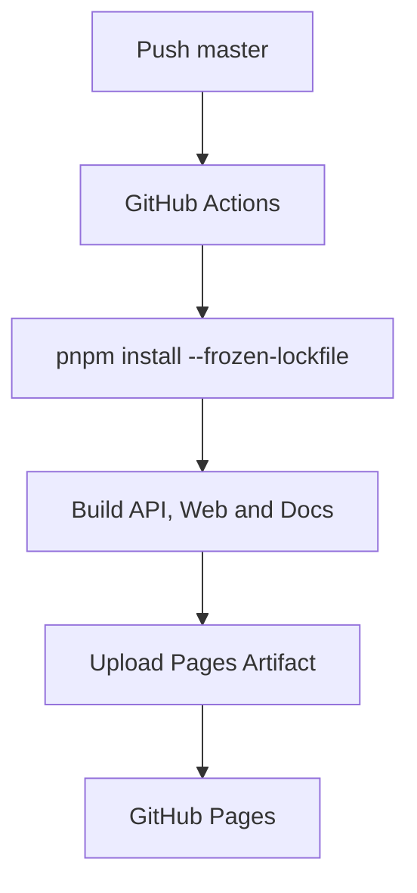

# 部署流程

应用镜像由 `container/Dockerfile` 构建；文档站由 Rspress 输出静态资源并通过 Pages Artifact 发布。

应用容器使用 `DATABASE_RUNTIME_URL` 执行业务查询、使用 `DATABASE_MIGRATOR_URL` 执行启动迁移。首次部署通过 `PLATFORM_ADMIN_*` 注入运维管理员凭据；启动会幂等确保账号存在且角色为 `platform-admin`。生产应替换仓库示例密码并从密钥管理系统提供该值。
