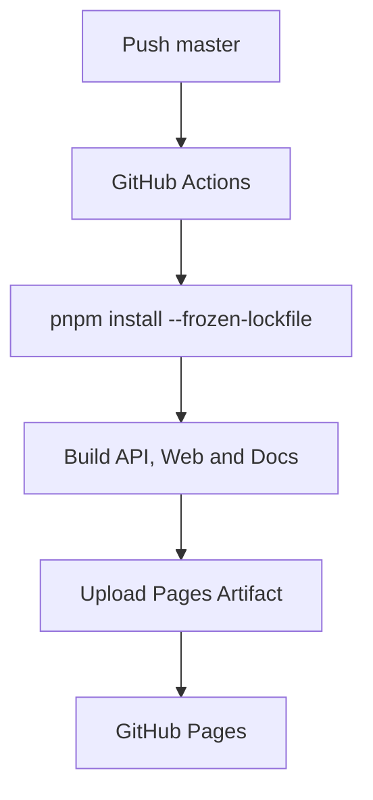

# 部署流程

应用镜像由 `container/Dockerfile` 构建；文档站由 Rspress 输出静态资源并通过 Pages Artifact 发布。

同一 API workspace 编译出四个明确进程入口：`dist/entrypoints/api.js`、`dist/entrypoints/jobs-worker.js`、`dist/entrypoints/migrate.js` 和 `dist/entrypoints/admin-provision.js`。容器命令只选择对应入口；配置分别由 API、Worker、migration、provision 模块解析。

本仓库 Compose 用于本地和 CI 的生产形态验证。`just stack-up` 使用一个应用镜像运行 API、Worker、统一 migration 和一次性 admin-provision 服务。migration 使用 `DATABASE_MIGRATOR_URL`；API、Worker 与 provision 使用 `DATABASE_RUNTIME_URL`。API 和 Worker 不执行 DDL，API 也不接收管理员初始密码。真实部署编排应复用同一镜像及 migration → admin-provision → 长期服务的顺序，并由密钥管理系统向短生命周期 provisioning 注入 `PLATFORM_ADMIN_*`。

本地生命周期有意拆为三个主要入口：`just dev` 是含基础设施和宿主机 watch 进程的一站式开发；`just infra-up` 准备 PostgreSQL、Collector 并执行 migration/provision；`just stack-up` 验证生产形态容器。基础设施已就绪时，`just dev-only` 跳过基础设施步骤，仅启动 API、Worker 和 Web。停止命令默认保留数据卷；只有明确执行 `just infra-reset` 才会删除开发 PostgreSQL data volume。
