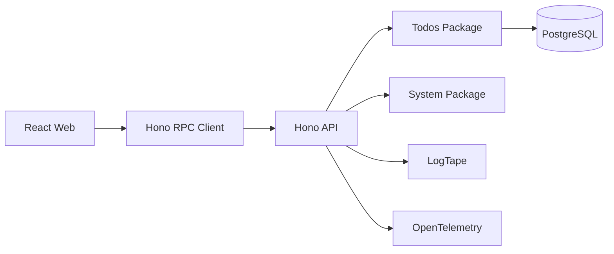

# 系统架构

项目是 TypeScript 模块化单体。`apps/api` 是唯一 HTTP 组合根，功能包通过 `setupXxxApp(app, options)` 注册路由并返回同一个 Hono app。

```mermaid
flowchart LR
  Web[React Web] --> Client[Hono RPC Client]
  Client --> API[Hono API]
  API --> Todos[Todos Package]
  API --> System[System Package]
  Todos --> DB[(PostgreSQL)]
  API --> Logging[LogTape]
  API --> OTel[OpenTelemetry]
```

图中展示的是运行时边界；详细请求流程见[请求生命周期](/architecture/request-lifecycle/)。
