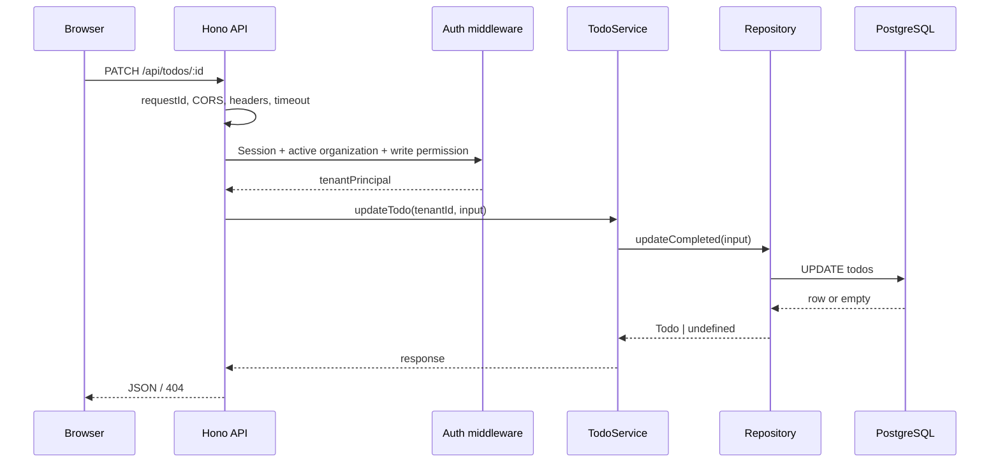

# 请求生命周期

```mermaid
sequenceDiagram
  participant B as Browser
  participant A as Hono API
  participant U as Auth middleware
  participant S as TodoService
  participant R as Repository
  participant D as PostgreSQL
  B->>A: PATCH /api/todos/:id
  A->>A: requestId, CORS, headers, timeout
  A->>U: Session + active organization + write permission
  U-->>A: tenantPrincipal
  A->>S: updateTodo(tenantId, input)
  S->>R: updateCompleted(input)
  R->>D: UPDATE todos
  D-->>R: row or empty
  R-->>S: Todo | undefined
  S-->>A: response
  A-->>B: JSON / 404
```
