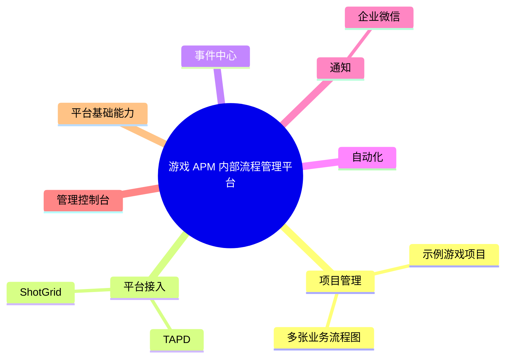
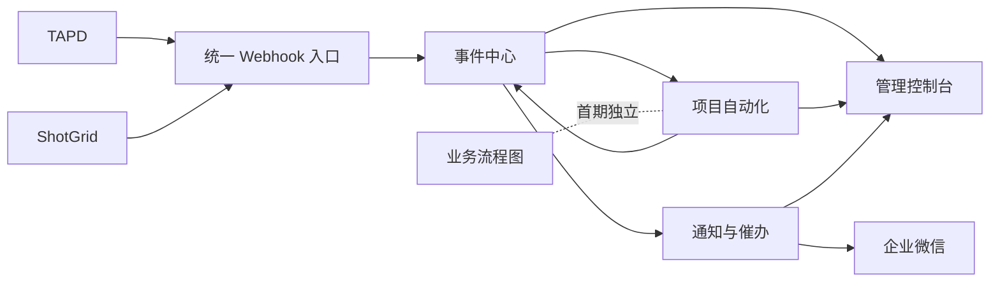

# 游戏 APM 内部流程管理平台：当前核心规划

> 状态：当前实施基线。平台定位为团队内部长期维护的多项目管理平台，初期采用模块化单体，不拆分微服务。

## 一、目标与设计原则

1. 平台管理多个游戏项目；项目是数据、权限、配置、事件、自动化和通知的隔离边界。
2. 当前外部流程平台为 TAPD 和 ShotGrid；一个平台实例、访问凭据和远端项目绑定是三个不同概念。
3. 初期不抽象跨项目统一业务模型，也不建设通用字段映射引擎。
4. 项目差异由项目专属 TypeScript 处理函数表达；BullMQ 负责调度、重试和进度，不承载业务规则。
5. TAPD、ShotGrid 共用一个 HTTP 服务、一个监听端口和统一 Webhook 路由，平台差异由 Adapter 处理。
6. 产品层只呈现事件中心；MsgBus 是事件中心内部基于 BullMQ 的订阅投递机制，不是独立产品模块。
7. PostgreSQL 是事件、投递、任务和消息历史的事实来源；Redis/BullMQ 数据允许按保留策略清理。
8. 一个项目可以维护多张业务流程图；首期仅作为可视化文档，不驱动 Job 或消息。

## 二、核心业务模块



“模块”表示业务职责边界，不要求每个模块成为独立服务或独立 package。模板、消息发送和企业微信客户端属于通知模块的内部组件；Job 定义、Worker 运行和任务中心页面属于自动化模块。

## 三、核心运行链路



外部事件和内部业务事件都先进入持久化事件链路，再由订阅投递触发自动化或通知。自动化可以产生新的业务事件，但必须携带因果关系，且订阅规则必须是显式白名单，避免递归触发。

## 四、平台接入与项目隔离

统一 Webhook 路由为：

```text
POST /api/webhooks/:provider/:hookId
```

- `provider` 选择 TAPD 或 ShotGrid Adapter。
- `hookId` 是不可预测的公开标识，用于定位 Webhook 配置和验签密钥引用，不直接暴露项目 ID。
- Adapter 负责读取原始请求、验签、运行时校验、提取来源事件 ID，并转换为最小事件信封。
- 数据访问和前端查询必须以服务端项目权限为准；项目 ID 不能只依赖客户端传入。
- 身份唯一键至少包含 `sourceInstanceId + sourceUserId`，不能只使用平台类型和用户 ID。

平台接入的数据关系为：

```text
平台实例 -> 访问凭据 -> 项目绑定 -> 远端项目
       \-> 外部用户身份 -> 内部用户或企业微信身份
```

同一个平台实例可以存在多套访问凭据，一个本地项目也可以绑定多个远端项目。首期若只支持一对一绑定，应作为产品限制显式写入配置校验，而不是隐含在数据模型中。

## 五、事件中心与可靠投递

事件中心内部包含：

```text
事件接入与 Inbox
事件存储
订阅注册与匹配
投递记录与 BullMQ 分发
事件查询与 Presenter
管理员重放
```

可靠性原则：

- 外部请求的 Inbox、事件记录和待分发状态在同一个 PostgreSQL 事务内写入，提交后即可快速响应。
- 后台分发器扫描待分发记录，为每个匹配的订阅者创建独立 Delivery，并投递到 BullMQ。
- 数据库提交和 Redis 入队无法组成同一个事务；分发器必须能够反复补投，消费者必须幂等。
- 内部业务状态变更需要可靠发布事件时，在同一数据库事务中写入业务数据和待发布事件。
- Event、Delivery、JobRun/Attempt 是三个不同生命周期，不能共用一个“处理状态”。
- BullMQ QueueEvents 只用于实时状态采集；数据库中的任务投影与校正流程负责长期查询和进程重启后的恢复。

详细方案参见 [事件中心规划](./event-center-plan.md)。

## 六、自动化与任务中心

项目专属处理函数负责：

- 查询 TAPD、ShotGrid 最新数据并执行项目自己的同步逻辑。
- 判断事件是否仍然有效，处理乱序和重复投递。
- 产生带因果关系的项目业务事件。
- 返回结构化结果，并通过执行包装层报告进度。

处理函数不直接依赖 BullMQ `Job` 对象；BullMQ Worker 只负责解析输入、建立执行上下文、调用处理函数、更新进度和记录结果。这样业务规则可以独立测试，也可被人工补同步复用。

任务中心展示技术执行状态，而不是复制 TAPD 或 ShotGrid 的业务任务：

```text
等待中 waiting
延迟执行 delayed
执行中 active
等待重试 retrying
已完成 completed
已失败 failed
取消中 canceling
已取消 canceled
```

取消采用协作式语义：已经开始的 Job 只有在处理函数检查取消信号后才能安全停止。前端通过任务 API 查询数据库投影，并用项目级 SSE 接收刷新提示，不直接访问 Redis；现有开发日志 SSE 不复用于业务推送。

## 七、通知与人工催办

通知模块内部包含通知规则、催办策略、模板、渠道配置、发送队列和发送记录。同步 Job 不直接发送企业微信消息。

催办不是 BullMQ Job 本身。催办规则至少需要定义：

- 外部业务对象、到期条件和当前责任人。
- 提醒对象、渠道、模板、频率和静默时间。
- 发送前重新确认对象仍未完成，避免使用过期事件误发。
- 去重窗口、最大提醒次数、停止条件和人工关闭方式。

TAPD 或 ShotGrid 继续作为业务任务状态的事实来源，本平台只保存规则、检查记录、消息投递和必要快照。事件操作者 `actor`、业务责任人 `assignee` 和消息接收人 `recipient` 必须分开建模。

## 八、业务流程图

- 一个项目可以创建多张业务流程图。
- 首期用于业务流程设计、说明和共享。
- 节点表达业务步骤，不表达 BullMQ Job。
- 不负责执行流程，不展示 Job 状态，也不触发消息。
- 未来是否与自动化打通，必须基于示例项目验证后单独设计。

## 九、当前技术架构

沿用现有 pnpm workspace、TypeScript、Hono、React、TanStack Query、Drizzle 和 PostgreSQL：

- `apps/api` 继续作为 Hono 显式组合根，通过 `setupXxxApp(app, options)` 组合路由，不引入通用模块注册器。
- 增加独立 Worker 入口运行 BullMQ 消费者和后台分发器；API 与 Worker 可以使用同一镜像、不同启动命令。
- Redis 只用于 BullMQ，不作为事件或任务的长期事实来源。
- 项目专属业务代码优先按项目聚合；只有稳定且确实复用的能力才提升为共享 package。
- API 边界使用 Zod 校验未知外部 Payload，内部 TypeScript 类型从 Schema 推导。
- TanStack Query 的查询键必须包含项目范围；SSE 只提示数据变化，最终状态由 API 查询数据库确认。

## 十、示例项目与首期验收

示例游戏项目包含 TAPD 和 ShotGrid 接入、项目专属自动化、多张业务流程图、一组通知与催办规则，以及企业微信测试对象。

首期按以下顺序落地：

1. 项目、成员权限、平台实例、凭据引用和项目绑定。
2. Redis、BullMQ Worker、任务运行记录和最小任务中心。
3. 统一 Webhook、两个 Adapter、Inbox 和可靠分发器。
4. 示例项目的专属处理函数和增量对账 Job。
5. 事件列表、Delivery 详情、Presenter 和受控重放。
6. 通知规则、模板、企业微信发送记录和一个催办场景。
7. 多张独立业务流程图。

除正常链路外，必须验证：

- 数据库提交后、Redis 入队前进程退出，事件最终仍会被投递。
- 同一事件重复到达和同一 Delivery 重复执行不会产生重复副作用。
- 一个订阅者失败不影响其他订阅者，且可单独重试。
- Worker 或 API 重启后任务历史和投递状态可以校正。
- 用户不能查询、重放或订阅无权限项目的数据。
- A -> B -> C 的快速连续更新不会被错误展示为另一段历史变化。

## 十一、暂不纳入首期

- 跨项目统一业务模型和通用字段映射引擎。
- 微服务拆分或引入第二套消息中间件。
- 流程图驱动 Job、通知或审批编排。
- 从企业微信反向修改 TAPD 或 ShotGrid。
- 全量复制外部平台的历史数据和附件。
- 任意前端组件或脚本由事件 Payload 动态注入。
- 严格的全局事件顺序和复杂事件流分析。

## 十二、仍需通过示例项目决定

- 首期订阅的 TAPD、ShotGrid 事件和轮询补偿范围。
- 项目处理函数的注册、版本和发布方式。
- 通知规则哪些由代码定义，哪些允许有限配置。
- 原始 Payload 的保留周期、脱敏字段和访问角色。
- Event Presenter 首期采用纯代码还是代码加有限配置。
