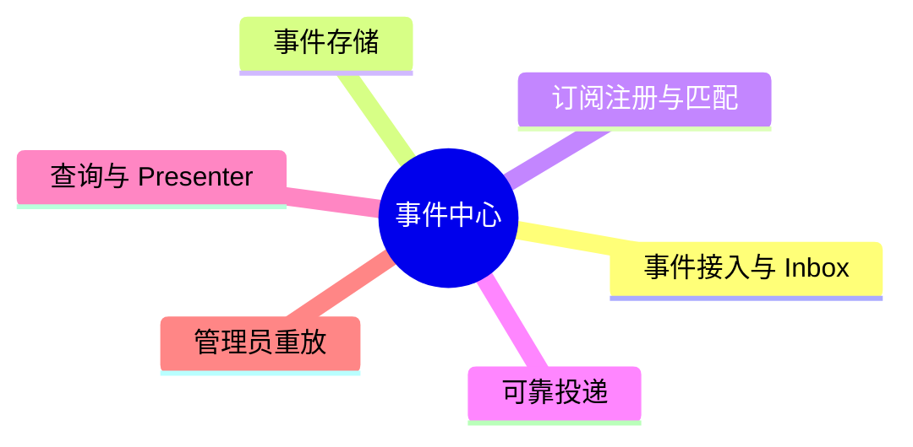
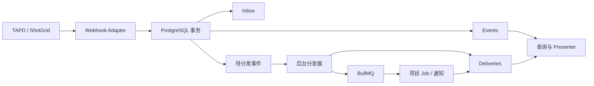
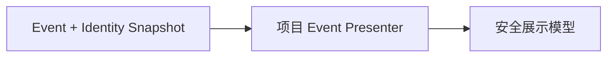

# 事件中心模块规划

> 状态：首期设计基线。本文细化事件中心；总体范围和术语以 [当前核心规划](./current-plan.md) 为准。

## 1. 模块定位

事件中心负责可靠地接收、保存、订阅投递、查询和重放事件。MsgBus 是事件中心内部的订阅匹配与异步投递机制，不作为独立产品或新的消息中间件。

事件中心不理解各游戏项目的字段含义，不执行项目同步，不决定通知策略，也不直接发送企业微信消息。



## 2. 责任边界

事件中心负责：

- 统一 Webhook 入口和 TAPD、ShotGrid Adapter 协议。
- 原始请求留存、来源验证、运行时校验和接收幂等。
- 最小事件信封、不可变事件记录和因果关系。
- 订阅匹配、独立 Delivery、补投、重试和死信状态。
- 项目权限下的事件查询、展示投影和受控重放。
- 接收项目业务事件和允许发布的平台运行事件。

事件中心不负责：

- 统一 TAPD、ShotGrid 或不同游戏项目的业务数据模型。
- 把轮询快照伪装成完整的历史用户操作。
- 管理项目 Job 的代码和进度细节。
- 决定业务责任人、通知对象或催办频率。
- 执行业务流程图。

## 3. 数据流与可靠性边界



Webhook 的数据库事务只覆盖 PostgreSQL，不能覆盖 Redis。分发器必须满足：

1. 持续扫描或领取仍待分发的事件。
2. 按当前启用的订阅生成独立 Delivery；`eventId + subscriberId` 建立唯一约束。
3. 使用不含冒号的稳定 BullMQ Job ID，例如 `delivery_<deliveryId>`。
4. 入队成功后更新 Delivery；若进程在入队与更新之间退出，允许再次补投。
5. 消费者按 Delivery 或业务副作用键保持幂等，不能仅依赖 BullMQ Job 去重。

内部模块发布业务事件时，应在修改业务数据的同一 PostgreSQL 事务中写入事件或待发布记录。没有业务事务的运行告警可以通过受控发布接口写入，但必须限制事件类型，避免“Job 失败 -> 通知失败 -> Job 失败”的递归放大。

## 4. 统一事件入口

```text
POST /api/webhooks/:provider/:hookId
```

- `provider` 选择 Adapter。
- `hookId` 定位 Webhook 配置、平台实例、项目绑定和验签密钥引用。
- URL 不直接暴露内部项目 ID，日志也不得记录完整密钥或原始敏感 Payload。
- Adapter 必须基于原始请求完成平台要求的验签，然后用 Zod 校验 `unknown` Payload。
- 无来源事件 ID 时，由 Adapter 根据平台允许的稳定字段生成幂等键，并记录生成策略。

接收接口只执行：读取原始请求、验证来源、解析并校验、在单个数据库事务中写入 Inbox 与待分发事件、快速返回。Redis 不可用不应导致已经验证的事件丢失。

## 5. 最小事件信封

```json
{
  "id": "evt_01",
  "eventKey": "delivery-123",
  "projectId": "example-game",
  "sourceInstanceId": "src_shotgrid_main",
  "projectBindingId": "bind_example_shotgrid",
  "producer": "shotgrid-adapter",
  "source": "shotgrid",
  "category": "external",
  "eventType": "Shotgun_Task_Change",
  "occurredAt": "2026-09-08T10:30:00Z",
  "receivedAt": "2026-09-08T10:30:01Z",
  "actor": {
    "sourceUserId": "88",
    "displayNameSnapshot": "Example User"
  },
  "subject": {
    "sourceType": "Task",
    "sourceId": "7821"
  },
  "causationId": null,
  "correlationId": "corr_01",
  "envelopeVersion": 1,
  "payloadSchema": "example-game/shotgrid-task-change@1",
  "payload": {}
}
```

约束：

- `eventKey` 在 `sourceInstanceId` 范围内唯一；内部事件使用生产者自己的稳定命名空间。
- `payload` 保留来源差异，但必须通过对应的运行时 Schema 验证。
- `envelopeVersion` 与项目 Payload 的 `payloadSchema` 分别版本化。
- 派生事件必须创建新的 ID，并保留 `causationId` 和同一业务链路的 `correlationId`。
- Event 记录不可变；展示修正、重放和投递变化写入独立记录。
- `actor` 只表示事件操作者；责任人和消息接收人从业务 Payload、查询结果或通知规则中另行解析。

## 6. 核心持久化记录

首期概念模型如下，名称可在数据库设计阶段调整：

| 记录 | 职责 |
| --- | --- |
| `source_instances` | TAPD 组织或 ShotGrid 站点等外部命名空间 |
| `source_credentials` | 访问凭据元数据和密钥引用，不保存明文密钥 |
| `project_bindings` | 本地项目与远端项目、实例及所用凭据的绑定 |
| `webhook_endpoints` | `hookId`、验签配置、启用状态和绑定关系 |
| `event_inbox` | 原始请求、验证结果、来源幂等键和接收状态 |
| `events` | 不可变事件信封、Payload、分类和因果关系 |
| `event_subscribers` | 稳定消费者及其显式事件匹配规则 |
| `event_deliveries` | 每个事件向每个消费者的投递生命周期 |
| `event_replays` | 操作者、原因、目标 Delivery、范围和结果 |
| `external_identities` | 外部实例用户与内部用户、企业微信身份的绑定 |

Event 本身没有“整体成功或失败”。同一个 Event 可以拥有多个 Delivery，彼此独立成功或失败。JobRun 和 Attempt 属于自动化模块，通过 `deliveryId` 与事件投递关联。

## 7. 订阅、投递与执行语义

消费者使用稳定 ID，例如：

```text
project.example-game.tapd-handler
project.example-game.shotgrid-handler
notification.example-game.task-reminder
```

订阅规则至少匹配 `projectId + category + source + eventType`，由代码或受限配置注册，不能执行任意表达式或脚本。平台运行事件默认不进入通用通知订阅，避免递归触发。

投递语义为“至少一次 + 幂等消费”，不承诺严格一次。项目处理函数应使用来源事件序号、对象更新时间或重新查询后的业务状态判断新旧，不能只依赖队列顺序。

需要注意：收到 A -> B 的事件后再查询平台“最新状态”，可能已经得到 C；这只能证明当前状态为 C，不能据此伪造 B -> C 的历史事件。事件 Payload 中的平台变化快照和查询到的当前状态应分别保存和展示。

BullMQ QueueEvents 用于采集 waiting、active、progress、completed、failed 等实时变化。由于事件流会裁剪，它不是永久审计日志；自动化模块需要持久化 JobRun/Attempt，并通过队列现状校正暂时遗漏的状态。

## 8. 查询与展示

事件中心页面首期提供：

- 按项目、来源实例、分类、事件类型、Delivery 状态和时间筛选。
- 查看事件信封、经脱敏的原始 Payload、因果链和各 Delivery。
- 查看操作者、业务责任人和消息接收人，但明确标注不同角色。
- 查看失败原因、尝试历史，并对指定失败 Delivery 执行重试。

前端不直接理解来源 Payload。Presenter 以 `projectId + source + eventType + payloadSchema` 选择：



展示模型只允许预定义字段：标题、摘要、头像、对象链接、字段变化和已注册展示类型。Payload 不得注入 HTML、JavaScript、组件名或任意 URL。

身份解析使用 `sourceInstanceId + sourceUserId`。Event 保存当时的显示名快照；当前头像和名称可以通过身份绑定补充。头像 URL 应由后端代理、白名单或安全的媒体策略控制，不能把任意 Payload URL 直接交给浏览器。

## 9. 重放与安全

重放不修改 Event，也不伪造新的业务事实。默认操作对象是某个失败或被跳过的 Delivery；只有明确需要重新执行全部订阅时才创建新的整事件重放批次。

- 项目成员只能查询有权限项目的 Event、Delivery 和 Payload。
- 原始 Payload 默认受限展示，并按来源配置脱敏和保留周期。
- 重放需要管理员权限、原因、审计日志和频率限制。
- 重放沿用原事件及 Payload Schema；不允许悄悄用新 Schema 改写历史事件。
- Webhook 接收设置请求体大小、速率和超时限制；不同 Adapter 可以有更严格限制。
- 密钥仅保存引用，不进入事件、日志、Job 数据或前端响应。

## 10. 首期实现顺序与验收

1. 建立来源实例、凭据引用、项目绑定和 Webhook Endpoint。
2. 实现 Event Inbox、Event 和待分发状态的事务写入。
3. 实现稳定订阅注册、Delivery 唯一约束和后台补投器。
4. 接入 BullMQ Worker，并持久化 JobRun/Attempt。
5. 将事件投递给示例项目处理函数和一个通知消费者。
6. 建立事件列表、详情、Presenter、失败 Delivery 重试和审计。
7. 增加 TAPD、ShotGrid 增量同步或对账 Job，补偿平台 Webhook 缺失。

验收必须覆盖重复 Webhook、Redis 暂时不可用、入队中途退出、Worker 重启、乱序事件、部分订阅者失败、跨项目越权和递归事件保护。

## 11. 暂不纳入首期

- 跨项目统一业务模型和可视化字段映射器。
- 第二套消息中间件或微服务拆分。
- 严格全局事件顺序和 exactly-once 承诺。
- 任意脚本式订阅规则或前端动态组件注入。
- 业务流程图执行、长期事件 BI 和复杂流处理。

## 12. 待示例项目验证

- TAPD、ShotGrid 首期事件清单及各自验签、幂等能力。
- 原始 Payload 保留周期和具体脱敏规则。
- Presenter 采用纯代码还是代码加有限配置。
- 哪些平台运行事件允许项目成员查看。
- 一个本地项目是否需要绑定同一平台实例中的多个远端项目。
